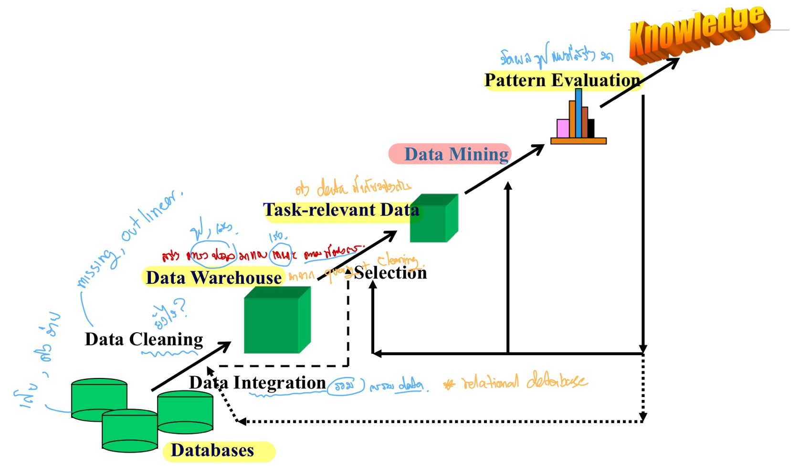
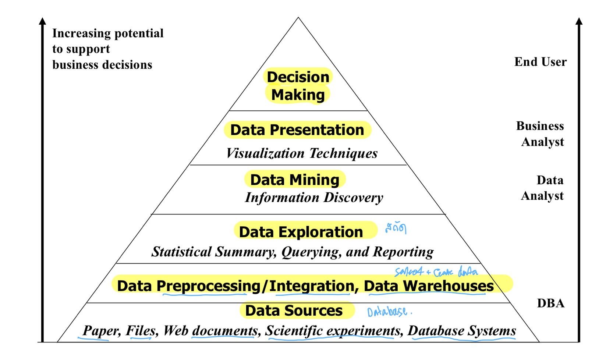
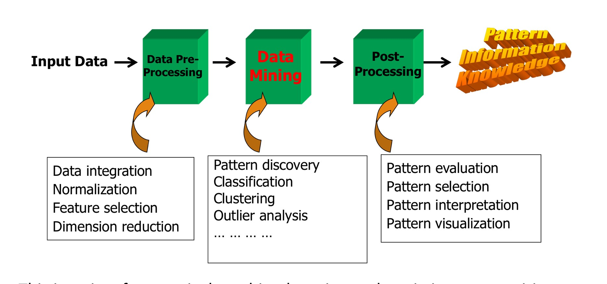
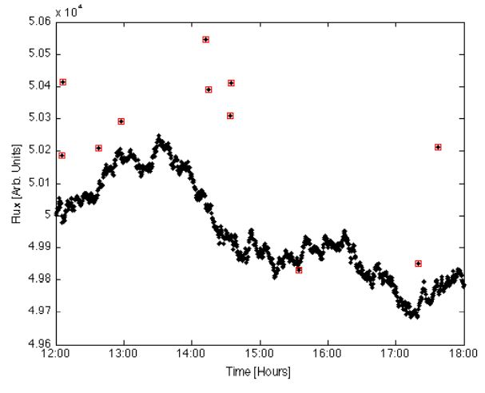

# บทที่ 1: Introduction 
 Week 1 / SC637802 Data Pre-processing and Data Mining

By YUPAPORN WANNA 645020061-2

<!-- TABLE OF CONTENTS -->

  
Table of Contents

  <ol>
    <li>
      <a href="#ทำไม-Data-Mining-ถึงมีความสำคัญ">ทำไม Data Mining ถึงมีความสำคัญ</a>
      <ul>
        <li><a href="เเหล่งข้อมูลหลัก">เเหล่งข้อมูลหลัก</a></li>
      </ul>
    </li>
    <li><a href="#Knowledge-Discovery-Process">Knowledge Discovery Process</a></li>
    <li><a href="#Data-Mining-in-Business-Intelligence">Data Mining in Business Intelligence</a></li>
    <li><a href="#KDD-Process-A-View-from-ML-and-Statistics">KDD Process: A View from ML and Statistics</a></li>
    <li><a href="#Data-Mining-Functions-1-Pattern-Discovery">Data Mining Functions 1 Pattern Discovery</a></li>
    <li><a href="#Data-Mining-Functions-2-Classification-and-3-Cluster-Analysis">Data Mining Functions 2 Classification and 3 Cluster Analysis</a></li>
    <li><a href="#Data-Mining-Functions-4-Outlier-Analysis">Data Mining Functions 4 Outlier Analysis</a></li>
  </ol>

## ทำไม Data Mining ถึงมีความสำคัญ
> เนื่องจากปัจจุบัน ข้อมูลเป็นสิ่งที่มีค่ามาก ตามคำกล่าวที่ว่า "Data is the new oil"  น้ำมันดิบก็คือข้อมูลดิบ ที่ต้องผ่านกระบวนการสกัดก่อนถึงจะนำไปใช้ประโยชน์ได้ โดยข้อมูลดิบก็ต้องอาศัยกระบวนการสกัดก่อน เพื่อที่จะได้มาถึงองค์ความรู้หรือสารสนเทศที่เป็นประโยชน์ 

> เเหล่งข้อมูลหลัก
> - Business: Web, e-commerce, transactions, stocks, … 
> - Science: Remote sensing, bioinformatics, scientific simulation, … 
> - Society and everyone: news, digital cameras, YouTube 

> ซึ่งการจะได้มาของ องค์ความรู้หรือสารสนเทศที่เป็นประโยชน์ จากข้อมูลนั้น ต้องใช้ " Data Mining" เป็นเครื่องมือในการสร้างหรือสกัดข้อมูลเหล่านั้น เพราะสิ่งที่เราต้องการ -> ความรู้จากข้อมูล ไม่ใช้ข้อมูล

## Data Mining คืออะไร?
> Data Mining (องค์ความรู้ที่ได้มาจากข้อมูล)
> - การดึงข้อมูลที่อยากรู้หรือสนใจ รูปแบบหรือองค์ความรู้จากข้อมูลที่มหาศาล
## Knowledge Discovery Process
Knowledge Discovery (KDD) Process
> Databases -> Data Warehouse(Data Cleaning&Data Integration) -> Task-relevant Data/ข้อมูลที่เกี่ยวข้องกัน(Selection) -> "Data Mining" -> Pattern Evaluation/การประเมินรูปแบบ -> knowledge(องค์ความรู้)
> 

## Data Mining in Business Intelligence
>  

## KDD Process A View from ML and Statistics
>Input Data -> Data Pre Processing -> Data Mining -> Post Processing -> knowledge, pattern, Information
> 

## Data Mining Functions 1 Pattern Discovery
> รูปแบบความถี่ 
> 
> "association rule" : คือรูปของข้อมูลที่เกิดขึ้นเเบบมีความเกี่ยวข้องกันหรือมีความสัมพันธ์กัน support ซึ่งกันและกัน 
>> Ex. Diaper -> Beer [0.5%, 75%] (support, confidence) : ส่วนใหญ่คนที่ไปซื้อผ้าอ้อมเด็ก จะซื้อเบี่ยร์ด้วยเเทบทุกครั้งคิดเป็น 75% ที่ซื้อ(พ่อบ้าน) นั้นคือการเกิดขึ้นของข้อมูลมีความสัมพันธ์กัน 

## Data Mining Functions 2 Classification and 3 Cluster Analysis
> 
> - Classification คือการเเบ่งกลุ่มให้กับข้อมูลตามลักษณะของข้อมูล โดยที่ทราบ Class Label 
> - Cluster Analysis คือการเเบ่งกลุ่มให้กับข้อมูลตามลักษณะของข้อมูลเมหื่อนกับ Classification เเต่ไม่ทราบ Class Label 

## Data Mining Functions 4 Outlier Analysis
> Outlier Analysis คือ การวิเคราะห์เเละจัดการค่าผิดปกติของข้อมูล ค่า Outlier: ค่าที่ของข้อมูลที่เกิดจากข้อผิดพลาดจากการวัด การเก็บ  หรือเครื่องมือ อื่นๆ มักจะเป็นค่าที่สูงเกิน-ต่ำเกิน หรือค่าที่ต่างจากข้อมูลส่วนใหญ่ ตามรูปด้านล่างนี้
> 
----

