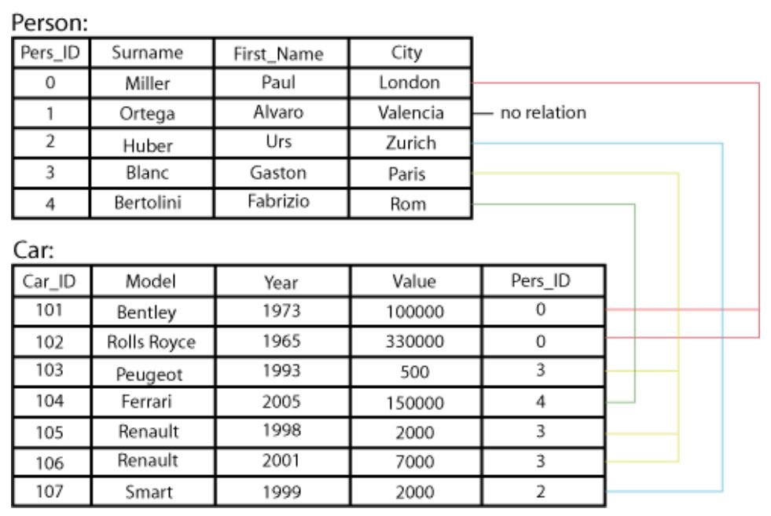
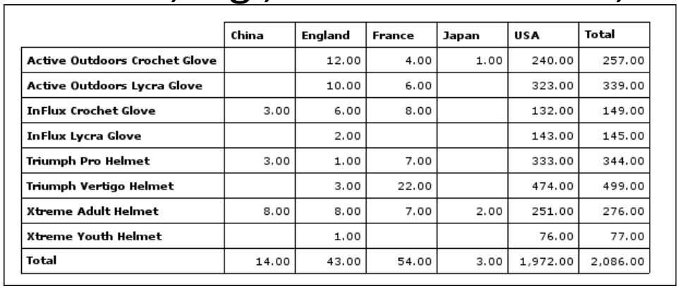
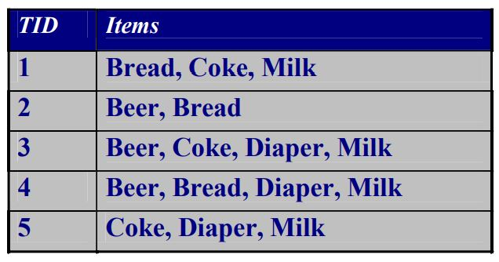
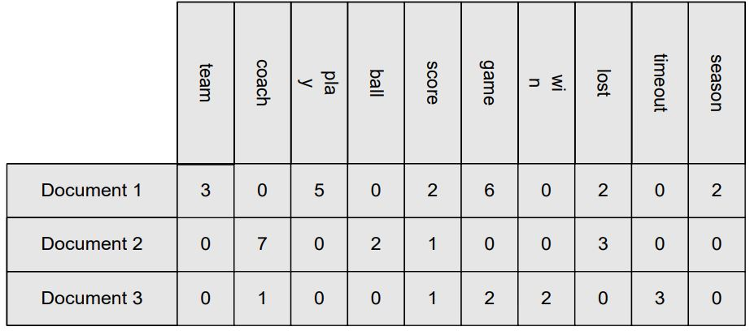
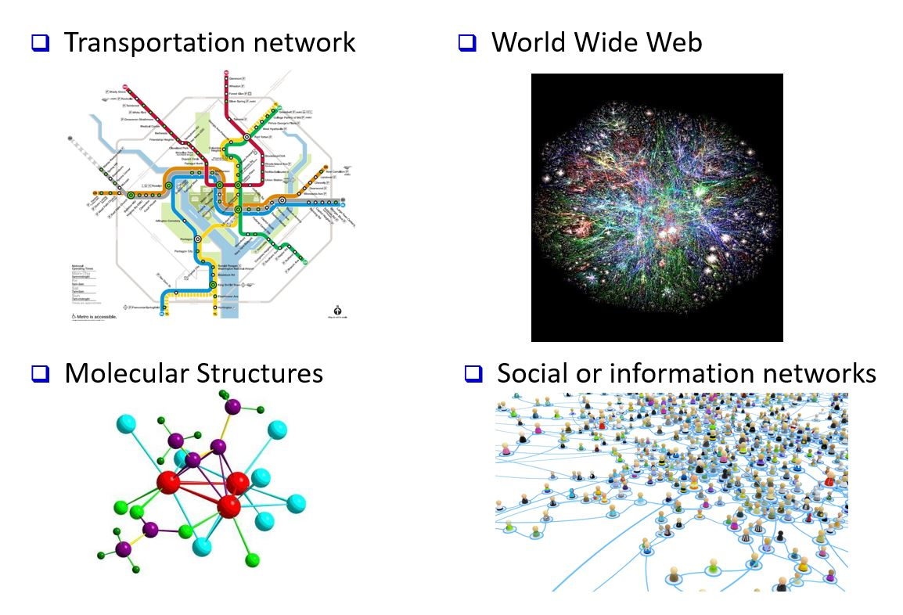
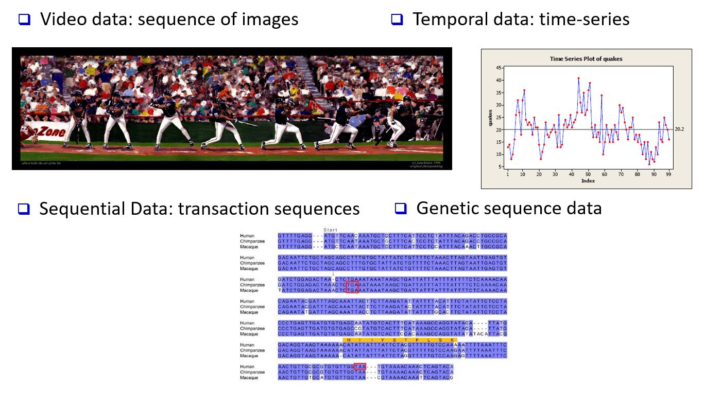
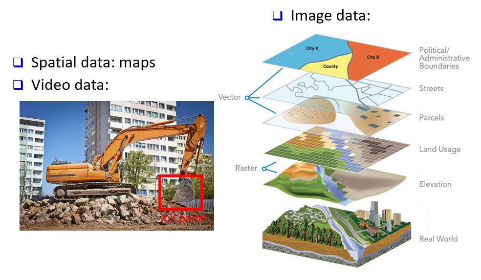

Week 2 / SC637802 Data Pre-processing and Data Mining

By YUPAPORN WANNA 645020061-2
 
---
# บทที่ 2: การทำความเข้าใจข้อมูล (Getting to Know Your Data) 
<!-- TABLE OF CONTENTS -->

  
Table of Contents

  <ol>
    <li><a href="#ประเภทของข้อมูล-(Types-of-Data-Sets)">ประเภทของข้อมูล (Types of Data Sets)</a></li>
    <li><a href="#ลักษณะสำคัญของโครงสร้างข้อมูล-(Important-Characteristics-of-Structured-Data)">ลักษณะสำคัญของโครงสร้างข้อมูล (Important Characteristics of Structured Data)</a></li>
    <li><a href="#Data-Objects-and-Attribute-Types">Data Objects and Attribute Types</a></li> 
    <li><a href="#KDD-Process-A-View-from-ML-and-Statistics">KDD Process: A View from ML and Statistics</a></li>
    <li><a href="#Data-Mining-Functions-1-Pattern-Discovery">Data Mining Functions 1 Pattern Discovery</a></li>
    <li><a href="#Data-Mining-Functions-2-Classification-and-3-Cluster-Analysis">Data Mining Functions 2 Classification and 3 Cluster Analysis</a></li>
    <li><a href="#Data-Mining-Functions-4-Outlier-Analysis">Data Mining Functions 4 Outlier Analysis</a></li>
  </ol>

## 2.1 Data Objects and Attribute Types
### 2.1.1 ประเภทของข้อมูล (Types of Data Sets) 

(1) Record Data
> - Relational records
 
 
 
> - Data matrix, e.g., numerical matrix, crosstabs
 
 
 
> - Transaction data
 
 
 
> - Document data: Term-frequency vector (matrix) of text documents
 
 
 

(2) ประเภทข้อมูลที่เป็นกราฟเเละเคลือข่าย (Graphs and Networks)
>  
 
 

(3) ประเภทข้อมูลที่เป็นอันดับหรือลำดับเเละลำดับของข้อมูลมีความสำคัญ (Ordered Data)
>  
 
 

(4) ประเภทข้อมูลลักษณธเชิงพื้นที่ รูปภาพ เเละวิดีโอ (Spatial, image and multimedia Data)
>  
 
 

### 2.2.2 ลักษณะสำคัญของโครงสร้างข้อมูล (Important Characteristics of Structured Data)
- มิติของข้อมูล (Dimensionality)
- Sparsity : สนใจเเค่จุดที่เเสดงหรือมีค่า ถ้าไม่มีค่าจะไม่สนใจ
- ความละเอียดของข้อมูลในการเเสดงผล (Resolution): รูปแบบขึ้นอยู่กับขนาดของข้อมูล
- การกระจาย (Distribution): ศูนย์กลางและการกระจายตัว Ex. mean, mode and median 

### 2.2.3 Data Objects and Attribute Types
- Data Objects
- คุณลักษณะของข้อมูล (Attributes)
- ประเภทของคุณลักษณะของข้อมูล (Attribute Types) 
  - นามบัญญัติ (Nominal)
  - ข้อมูลที่ 2 ค่า (Bianry)
  - เรียงลำดับ (Ordinal)
- ประเภทคุณลักษณะของข้อมูลที่เป็นตัวเลข (Numeric Attribute Types)
  - เป็นข้อมูลเชิงปริมาณ (Quantity): จำนวนเต็มเเละจำนวนเต็ม
  - ข้อมูลระดับอันตภาคชั้น (Interval):ข้อมูลไม่ใช่ 0 เเท้, ลำดับข้อมูลมีค่า, ระยะห่างระหว่างค่าเท่ากัน Ex.อุณหภูมิในหน่วย C˚or F˚ ในแต่ล่ะวัน
  - ข้อมูลระดับอัตราส่วน (Ratio): ข้อมูลที่เป็น 0 เเท้ Ex.อุณหภูมิในหน่วยเคลวิน ความยาว นับ ปริมาณเงิน 
- Discrete vs. Continuous Attributes 
  - ข้อมูลที่มีลักษณะไม่ต่อเนื่อง (Discrete Attribute): มีเพียงชุดค่าจำกัดหรืออนันต์ที่นับได้เท่านั้น บางครั้ง แสดงเป็นตัวแปรจำนวนเต็ม Ex. รหัสไปรษณีย์ อาชีพ หรือชุดคำในชุดเอกสาร
  - ข้อมูลที่มีลักษณะต่อเนื่อง (Continuous Attribute): มีตัวเลขจริงเป็นค่าแอตทริบิวต์ ในทางปฏิบัติ ค่าจริงสามารถวัดและแสดงโดยใช้ตัวเลขจำนวนจำกัดเท่านั้น คุณลักษณะต่อเนื่องมักจะแสดงเป็นตัวแปรที่มีค่าเป็นทศนิยม Ex. อุณหภูมิ ส่วนสูง หรือน้ำหนัก

